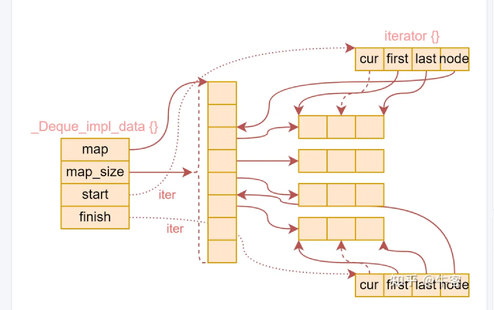

# std::deque 内部实现与特性

- `std::deque` 支持随机访问（如 `operator[]`, `at()`），可以高效遍历。
- 内部实现为**分段连续内存块**（每块通常存 8~512 个元素），所有块的地址通常较为接近，每块内部元素物理地址是连续的。
- 遍历/批量操作快：访问相邻元素时，大概率已在 CPU cache 中。
- **内存分配效率高**：deque 的块是批量分配的，分配/释放次数远少于 list 的节点逐个分配。
- 在中间插入元素时，如果相关块空间足够，不会扩容；如果空间不足，会分配新块（局部扩容），但不会整体扩容。



---

## 块大小的计算方式（以 GCC libstdc++ 为例）

```cpp
__deque_buf_size(size_t __size)
{ 
    return (__size < _GLIBCXX_DEQUE_BUF_SIZE
        ? size_t(_GLIBCXX_DEQUE_BUF_SIZE / __size) 
        : size_t(1)); 
}
```
- `_GLIBCXX_DEQUE_BUF_SIZE` 通常为 512。
- 如果元素小于 512 字节，每块存多个元素，总块大小接近 512 字节。
- 如果元素大于等于 512 字节，每块只存 1 个元素，块大小就是元素大小。

> deque 的块大小阈值（如 `_GLIBCXX_DEQUE_BUF_SIZE=512`）不是 C++ 标准强制要求的，而是实现（如 GCC libstdc++、libc++ 等）为性能和内存利用权衡选择的经验值。

---