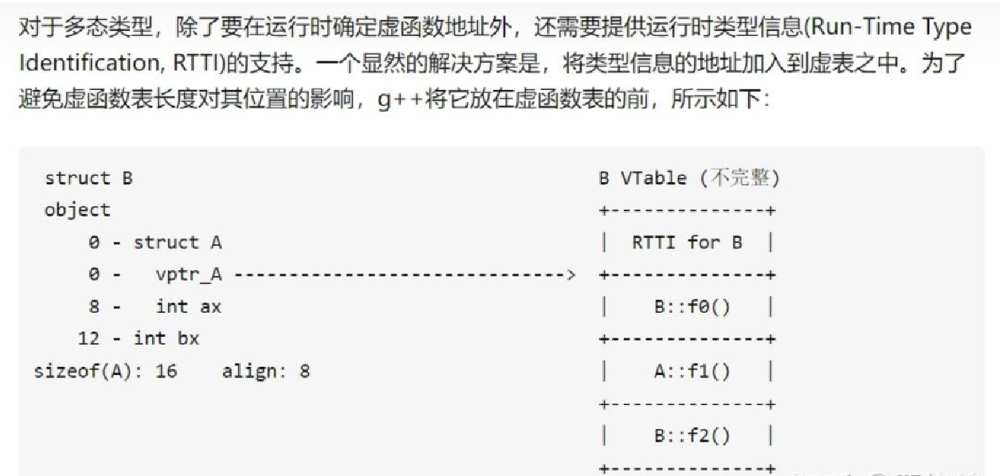

# 虚函数与 C++ 的零成本抽象

在正式讨论虚函数前，需要明确 C++ 的设计思想——**零成本抽象**。

- **类这个概念，只存在于编译时期。**

在 C++ 中，**普通成员函数（非虚函数）**不会在类的实例中占用任何额外空间。它们的代码存储在程序的代码段中，所有对象共享一份函数代码。普通成员函数不会在每个对象中存储指针指向它，编译器生成的调用指令会直接将函数调用绑定到具体的函数地址（静态绑定）。

而**虚函数表（vtable）**确实存储了指针，每个指针指向实际的虚函数实现地址。这些指针用于实现**动态绑定**，即在运行时根据对象的实际类型选择正确的虚函数。

